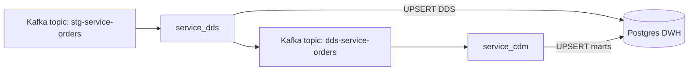

# Kafka → Postgres DWH: DDS + CDM пайплайн (Python microservices)

Учебный проект (Data Engineering): построение DWH на PostgreSQL из Kafka-событий о заказах.

- **`service_dds`**: читает заказы из Kafka → заполняет слой **DDS** в Postgres → публикует нормализованное сообщение в Kafka для downstream.
- **`service_cdm`**: читает нормализованные сообщения → строит витрины **CDM** в Postgres (под BI, например DataLens).

Таблицы в Postgres создаются автоматически при первом запуске сервисов (идемпотентно).

## Архитектура



## Что демонстрирует проект (для портфолио)

- **Идемпотентная загрузка**: `INSERT ... ON CONFLICT DO UPDATE` в DDS и CDM (можно безопасно переобрабатывать сообщения).
- **Корректная семантика consumer commit**: commit только после успешной записи/публикации; «плохие» сообщения логируются и скипаются, чтобы не стопорить consumer-group.
- **Автоматическое создание схем/таблиц**: `dds.*` и `cdm.*` поднимаются на старте (без ручного DDL).
- **Готовность к YC/K8s**: сборка образов под `linux/amd64`, CA для Managed сервисов YC внутри контейнера.

## Стек

- Python 3.10, Flask (health endpoint), APScheduler (периодический job)
- Kafka (`confluent_kafka`)
- PostgreSQL (`psycopg`)
- Docker / Docker Compose
- Kubernetes (манифесты)

## Структура репозитория

- `solution/service_dds`: сервис загрузки DDS (Kafka → Postgres → Kafka)
- `solution/service_cdm`: сервис построения витрин (Kafka → Postgres)
- `solution/k8s`: Kubernetes-манифесты (templates)
- `solution/scripts`: вспомогательные скрипты
- `solution/docker-compose.yaml`: локальный запуск
- `solution/.env.example`: пример переменных окружения

## Предварительные требования

- **Kafka** и доступ к топикам:
  - `stg-service-orders` — вход для DDS
  - `dds-service-orders` — выход DDS / вход CDM
- **Postgres DWH** (доступен по сети из окружения запуска)

## Локальный запуск (Docker Compose)

1) Подготовить переменные окружения:

```bash
cp solution/.env.example solution/.env
```

Заполни `solution/.env` (файл уже в `.gitignore`, **не коммить**).

2) Запуск:

```bash
docker compose --env-file solution/.env -f solution/docker-compose.yaml up --build
```

## Запуск в Kubernetes

### 1) Собрать и запушить образы

В `solution/Makefile` уже задан registry. При необходимости переопредели `REGISTRY/REPO/TAG`.

```bash
cd solution
make push
```

Важно: `make push` собирает образы под `linux/amd64` (актуально для Apple Silicon → YC K8s).

### 2) Задеплоить в кластер

Манифесты лежат в `solution/k8s` (шаблоны).

```bash
kubectl create namespace sprint9 --dry-run=client -o yaml | kubectl apply -f -
kubectl -n sprint9 apply -f solution/k8s/00-configmap.yaml
```

Секреты создай командой (пароли вводи только в терминале):

```bash
kubectl -n sprint9 create secret generic sprint9-dwh-secrets \
  --from-literal=KAFKA_CONSUMER_USERNAME="..." \
  --from-literal=KAFKA_CONSUMER_PASSWORD="..." \
  --from-literal=PG_WAREHOUSE_PASSWORD="..."
```

Применить деплойменты:

```bash
kubectl -n sprint9 apply -f solution/k8s/10-dds-deployment.yaml
kubectl -n sprint9 apply -f solution/k8s/20-cdm-deployment.yaml
```

Подробности: `solution/k8s/README.md`.

## Проверка результата

### Kubernetes

```bash
kubectl -n sprint9 get pods
kubectl -n sprint9 logs deploy/dds-service --tail=50
kubectl -n sprint9 logs deploy/cdm-service --tail=50
```

Если в Kafka нет новых сообщений, `processed=0` в логах — это нормально.

### Postgres (пример)

Проверить, что таблицы поднялись и заполняются:

```sql
select count(*) from dds.fct_orders;
select count(*) from cdm.category_stats;
select count(*) from cdm.product_stats;
```

## DataLens (опционально)

Источник: Postgres. Таблицы витрин:

- `cdm.category_stats`
- `cdm.product_stats`

Ссылка на дашборд: **TODO**
